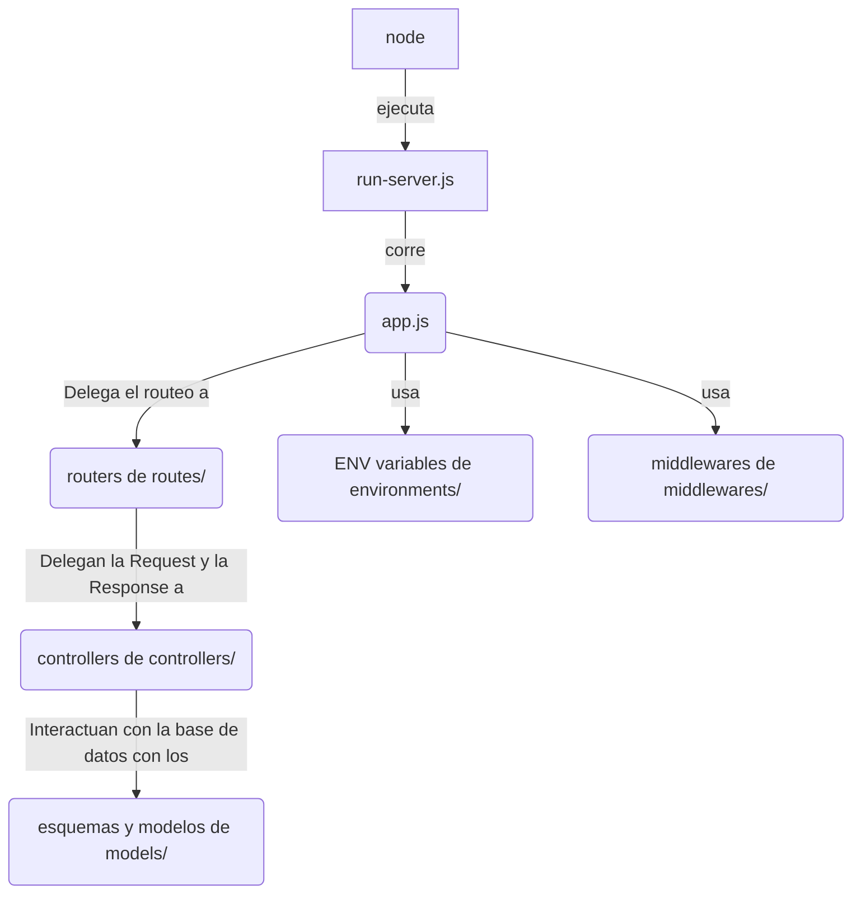

# Organización del Backend

El backend se organiza de la siguiente forma

```bash
.
├── package.json
├── package-lock.json
├── src
│   ├── app.ts # Inicia la aplicacion, es llamado por run-server.ts
│   ├── controllers/ # Se encarga de recibir las Requests, y en base a un modelo, enviar una Response
│   ├── middlewares/ # Se encarga de los middlewares necesarios, como el CORS
│   ├── models/ # Se encarga de definir los esquemas y modelos de datos de mongoose
│   ├── routes/ # Se encarga de mapear las urls a un controller
│   ├── enviroments/ # Aca estan los enviroments usados en desarrollo y produccion
│   ├── run-server.ts # Corre el server
│   └── swagger/ # En swagger se define la specificacion de OpenAPI usada por swagger
│       ├── unaRouteAca/ # Se hace esta carpeta por cada route
│       │   ├── routes.js # Se definen los endpoints de una ruta
│       │   ├── schema.js # Se define el esquema de datos a usar en el endpoint
│       │   └── tags.js # Se definen los tags de esa ruta, usado tanto en ./routes.js como en ../openapi.js
│       └── openapi.js # La spec
└── tsconfig.json
```

## Las rutas

Estas fueron documentadas en base a esta guía https://medium.com/@HargitaiSoma/how-you-should-have-started-to-add-swagger-to-your-express-api-672a6b0a6680

Podes encontrar la documentación de las mismas levantando el servidor con `npm run dev` y yendo al endpoint `/docs`

Tambien podes encontrar ejemplos de uso en ./requests.http

## Como son manejados los enviroments

Dentro de src/enviroments/, hay archivos .env usados para development y producción. **Estos no contienen credenciales**, y definen cosas como

- DATABASE_URL
- DATABASE_NAME
- PORT

Los levanta src/app.ts usando dotenv. El ambiente que se setee depende de cross-env en los scripts de `package.json`:

```json
	"scripts": {
		"build": "cross-env NODE_ENV=production npx tsc", // <-- Usa .env.production
		"start": "cross-env NODE_ENV=production node dist/run-server.js", // <-- Usa .env.production
		"dev": "cross-env NODE_ENV=development tsx watch ./src/run-server.ts" // <-- Usa .env.development
	},
```

## Como es la relación entre los archivos y carpetas del backend?


